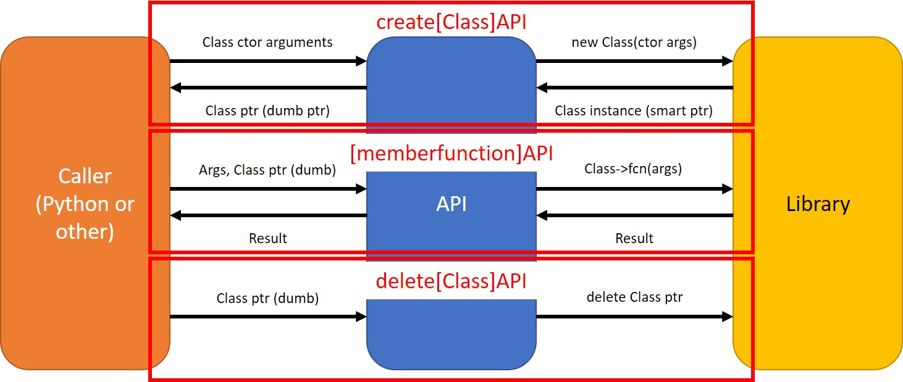

# API





### What is it?
---
**`[functionName]API`**

The C API provides access to a number of class member and standalone functions in the library.  Functions are exported as "extern C", and as such, are able to be accessed by Python ctypes, as well as other callers requiring C linkage.  The above image gives a general representation of how API references to class member functions work.  Naming convention is generally: `[functionName]API`.

*Note: In addition, the functions within `namespace utils` are also exported, but with C++ linkage.  These need to be called from C++ or through some other method that allows for this linkage.  Generally, these functions shouldn't need to be accessed through Python, hence the C++ linkage.  They are also not listed here, but documented in the [utils](./../utils/README.md) docs.*


### Use
---
Generally speaking, API functions take in a pointer to an instance of a C++ class (if it's an API wrapper for a class member function, which is *not* `create`) as the first argument, followed by the function arguments, if any.  If it is a class creation API wrapper, it takes the arguments required for that class's constructor and returns a pointer to the class instance created.  If it is a class destruction API wrapper, it takes in the pointer to the class and returns nothing.


### Simulation API Functions
```
//Simulation Management Functions
Sim* createSimulationAPI(double dt, double simMin, double simMax, const char* rootdir);
Sim* loadCompletedSimDataAPI(const char* fileDir);
void initializeSimulationAPI(Sim* sim);
void __iterateSimCPUAPI(Sim* sim, int numberOfIterations, int itersBtwCouts);
void iterateSimulationAPI(Sim* sim, int numberOfIterations, int itersBtwCouts);
void freeGPUMemoryAPI(Sim* sim);
void saveDataToDiskAPI(Sim* sim);
void terminateSimulationAPI(Sim* sim);
void setupExampleSimulationAPI(Sim* sim, int numParts, const char* loadFileDir);
void setupSingleElectronAPI(Sim* sim, double vpara, double vperp, double s, double t_inc);

//Field Management Functions
double getBFieldAtSAPI(Sim* sim, double s, double time);
double getEFieldAtSAPI(Sim* sim, double s, double time);
void   setBFieldModelAPI(Sim* sim, const char* modelName, const char* doubleString); //switch to comma delimited string of variables
void   addEFieldModelAPI(Sim* sim, const char* modelName, const char* doubleString);

//Particle Management Functions
void createParticleTypeAPI(Sim* sim, const char* name, double mass, double charge, long numParts, const char* loadFileDir = "");

//Satellite Management Functions
void          createSatelliteAPI(Sim* sim, int particleInd, double altitude, bool upwardFacing, const char* name);
int           getNumberOfSatellitesAPI(Sim* sim);
const double* getSatelliteDataPointersAPI(Sim* sim, int satelliteInd, int msmtInd, int attributeInd);
int           getPartIndOfSatAPI(Sim* sim, int satelliteInd);

//Access Functions
double        getSimTimeAPI(Sim* sim);
double        getDtAPI(Sim* sim);
double        getSimMinAPI(Sim* sim);
double        getSimMaxAPI(Sim* sim);
int           getNumberOfParticleTypesAPI(Sim* sim);
int           getNumberOfParticlesAPI(Sim* sim, int partInd);
int           getNumberOfAttributesAPI(Sim* sim, int partInd);
const char*   getParticleNameAPI(Sim* sim, int partInd);
const char*   getSatelliteNameAPI(Sim* sim, int satInd);
LogFile*      getLogFilePointerAPI(Sim* sim);
const double* getPointerToParticleAttributeArrayAPI(Sim* sim, int partIndex, int attrIndex, bool originalData);

//CSV Functions
void writeCommonCSVAPI(Sim* sim);
```

*Note: this section refers in general to most of the functions in the above list.  Select functions that are worthy of further documentation will be listed immediately below this section.*

#### Input:

`simulation` - the pointer to the simulation instance created by `createSimulationAPI`

`others` - see documentation of [Simulation](./../Simulation/README.md) member functions for more specifics on other arguments to the various functions


#### Output:
See documentation of [Simulation](./../Simulation/README.md) member functions for more specifics on the output of the various functions.


#### Side-Effects:
See documentation of [Simulation](./../Simulation/README.md) member functions for more specifics on the side effects of the various functions.


---
```
void setupExampleSimulationAPI(Simulation* sim, int numParts, const char* loadFileDir);
```
#### Inputs:
`sim` - described above

`numParts` - number of particles that Particle will contain

`loadFileDir` - where particle data will be loaded from.  *Note: name of data files must be preceded by "elec", as this is what the particle will be called.*


#### Outputs:
None


#### Side-Effects:
Adds DipoleBLUT BField Model at ILAT 72.0 degrees, no EField Model, a Particle set named "elec" with the characteristics of the electron, and Satellites: 1 at sim top, 1 at sim bottom, 1 at 4e6 dist "s" along field line with detector facing up, 1 at same s with detector facing down, and 1 each of up/down detector at 3e6 s.


[Up a level](./../README.md)