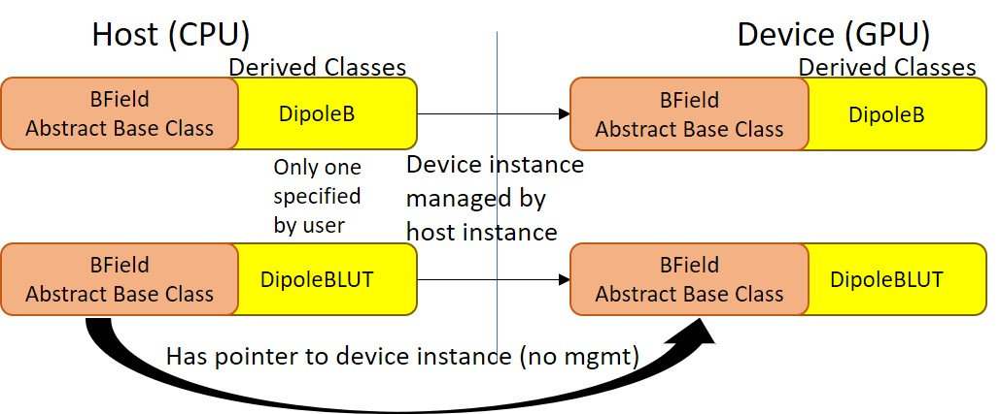

# BModel





### What is it?
---
**`protected:
    BModel(const char* modelName)`**

BModel is an abstract base class that represents a user-specified model of the simulation's Magnetic Field through a number of derived classes which implement different models.  BModel contains a number of pure virtual functions which provide a standard interface for obtaining the B Field and gradient of B of the underlying model, as well as a pointer to the GPU implementation of the derived class.  See below for a list of options and descriptions of the various models.

All management of device instances of derived classes is handled by the host instance of the derived class and not BModel itself.  This means if the user desires to create his own derived class, the host instance of the class is responsible for instantiating/deleting the device instance as well as allocating/freeing all device memory and does this automatically.  See how it's handled in [DipoleB.h](./../../include/BModel/DipoleB.h) and [DipoleB.cu](./../../src/BModel/DipoleB.cu) for an example of this.


### Available Models
---
`DipoleB` - a dipole magnetic field
`DipoleBLUT` - a lookup table (LUT) based implementation of `DipoleB` that calculates B in advance along the region in question, specified on instantiation, for a specified number of points and uses linear interpolation to derive B at the specified position


### Use
---
BModel is not able to be created on its own and will be automatically created when a derived class is instantiated.  While `DipoleB` and `DipoleBLUT` derived classes are able to be created on their own (and are for tests), usually these will be managed entirely by the [Simulation](./../Simulation/README.md) function `Simulation::setBFieldModel(std::string name, std::vector<double> args, bool save)`.  `name` refers to either "DipoleB" or "DipoleBLUT" (case-sensitive).  `args` refers to the constructor arguments (listed below) in a double vector.


### Constructors
---
```
DipoleB(double ILATDegrees, double errorTolerance = 1e-4, double ds = RADIUS_EARTH / 1000.0)
```
#### Input:
`ILATDegrees` - the invariant latitude of the dipole field line in degrees

`errorTolerance` - defines the error tolerance for calculating lambda (the latitude) at a given s (the distance along the field line from the Earth's surface) - error defined as: abs((s_iteration - s_specified) / s_specified); because this is calculated iteratively, the calculation needs this to be defined - obviously the lower the tolerance, the longer the calculation takes and the slower the sim runs

`ds` - value used to calculate grad B; an approximate grad B is taken by: `(B(s+ds) - B(s-ds)) / (2 * ds)`


#### Output:
None


#### Side-Effects:
New `DipoleB` instance is created.


---
```
DipoleBLUT(double ILATDegrees, double simMin, double simMax, double ds_gradB, int numberOfMeasurements)
```
#### Input:
`ILATDegrees` - the invariant latitude of the dipole field line in degrees

`simMin` - the minimum `s` in meters of the simulation

`simMax` - the maximum `s` in meters of the simulation

`ds_gradB` - value used to calculate grad B; an approximate grad B is taken by: `(B(s+ds) - B(s-ds)) / (2 * ds)`


#### Output:
None


#### Side-Effects:
New `DipoleBLUT` instance is created.


### Public Member Functions (BModel)
---
```
__host__ __device__ double getBFieldAtS(const double s, const double t) const
```
#### Input:
`s` - the distance along the specified field line, in meters, from the surface of the Earth

`t` - the time, in seconds, of the simulation; neither `DipoleB` nor `DipoleBLUT` are time-dependent, but this exists in case the user wishes to specify a time-dependent model


#### Output:
B Field strength in Tesla.  This can be called from both host and device.


#### Side-Effects:
None


---
```
__host__ __device__ double getGradBAtS (const double s, const double t) const
```
#### Input:
`s` - the distance along the specified field line, in meters, from the surface of the Earth

`t` - the time, in seconds, of the simulation; neither `DipoleB` nor `DipoleBLUT` are time-dependent, but this exists in case the user wishes to specify a time-dependent model


#### Output:
Gradient of B Field strength in Tesla/m.  This can be called from both host and device.


#### Side-Effects:
None


---
```
__host__ virtual std::string name()   const
__host__ virtual BModel** getPtrGPU() const
```
#### Input:
None


#### Output:
B Field element name and pointer to GPU instance, respectively


#### Side-Effects:
None