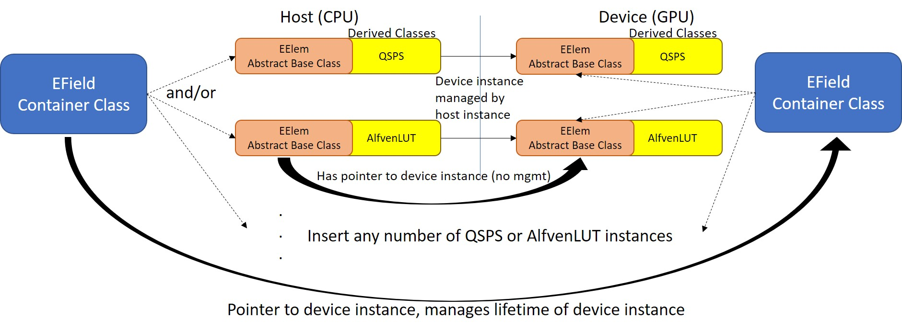

# EField and EModel





### What is it?
---
**`EField()`**

**`protected:
	EModel(const char* modelName)`**
	
EField is a container class which tracks (but does not manage - that is, creation and destruction) and consolidates the values of an arbitrary number of `EModel` derived classes.  This class is created upon instantiation of a [Simulation](./../Simulation/README.md), and destroyed upon its destruction.  `EModel` derived classes are created and added to the EField container through `EField:add(std::unique_ptr<EModel> elem)`.  Addition of the device instance of the `EModel` is handled automatically by `EField:add`.

EModel is an abstract base class that provides a common interface for a user specified E Field model.  EModel is the E Field equivalent of `BModel` [abstract base class](./../BModel/README.md), except with a different interface.  Derived models from EModel are responsible for creation and destruction of all host/device memory allocations.


### Available Models
---
`QSPS` - quasi-static potential structure: one or more time-independent potential regions specified via a min/max altitude and magnitude
`AlfvenLUT` - In Progress, Not available yet - a time-dependent, sinusoidal E wave specified by a lookup table


### Use
---
EField can be created with `std::make_unique<EField>()`.  It is also created automatically when a [Simulation](./../Simulation/README.md) is created.

EModel is an abstract base class, and as such cannot be created on its own.  It will be created when a derived class is.  `QSPS` and `AlfvenLUT` derived classes can be created through the constructors below, or with `Simulation::addEFieldModel(std::string name, std::vector<double> args, bool save)` where `name` is either "QSPS" or "AlfvenLUT" (not available yet), and args is a vector of arguments fed in to the associated model's constructor.


### Constructors
---
```
__host__ QSPS(std::vector<double> altMin, std::vector<double> altMax, std::vector<double> magnitude)
```
#### Input:
`altMin` - a vector of distance along the field line (s, in meters) where the specified regions start

`altMax` - a vector of distance along the field line (s, in meters) where the specified regions end

`magnitude` - magnitude of the (constant) Electric field in the region in question (in V/m)


#### Output:
None


#### Side-Effects:
Creates a `QSPS` instance on host and device, with the device instance managed by host.


---
```
AlfvenLUT - to be written
```
#### Input:
TBD


#### Output:
TBD

#### Side-Effects:
TBD


### Public Member Functions (EField)
---
```
__host__ __device__ double   getEFieldAtS(const double s, const double t) const
```
#### Input:
`s` - the distance along the specified field line, in meters, from the surface of the Earth

`t` - the time, in seconds, of the simulation


#### Output:
Sum of E Field strength of all tracked EModel instances, in Volts / meter.  This can be called from both host and device.


#### Side-Effects:
None


---
```
__host__ void add(std::unique_ptr<EModel> elem)
```
#### Input:
`elem` - a smart pointer to a host instance of an EModel-derived class


#### Output:
None


#### Side-Effects:
Adds `elem` to the host vector containing smart pointers to EModels.  Calls `getPtrGPU()` and adds the GPU pointer to the device instance associated with `elem` to the device instance of EField.  This allows the results of both host and device `getEFieldAtS` to be accurate.  This function also resizes the device array, if necessary, adding a capacity of 5 to the current capacity if the array is full.  `capacity()` and `size()` give the values associated with the function name, if the user desires to check them.


---
```
__host__ EField**    getPtrGPU() const
__host__ EModel*      element(int ind) const
__host__ std::string getEModelsStr() const
__host__ __device__ int capacity()  const
__host__ __device__ int size()      const
```
#### Input:
`ind` - index of the element to return the pointer of


#### Output:
Outputs the pointer to device EField instance, pointer to *host* EModel instance, a string of EModels - comma separated, the capacity of the vector holding the EModels, and the size of the vector holding the EModels, respectively.


#### Side-Effects:
None


### Public Member Functions (EModel)
---
```
__host__ __device__ virtual double getEFieldAtS(const double s, const double t) const
```
#### Input:
`s` - the distance along the specified field line, in meters, from the surface of the Earth

`t` - the time, in seconds, of the simulation


#### Output:
E Field strength of the element at a given s and t, in Volts / meter.  This can be called from both host and device.


#### Side-Effects:
None


---
```
__host__ virtual std::string name()  const
__host__ virtual EModel** getPtrGPU() const
```
#### Input:
None


#### Output:
Returns the name of the EModel as a string and the pointer to the GPU instance of the EModel, respectively.


#### Side-Effects:
None