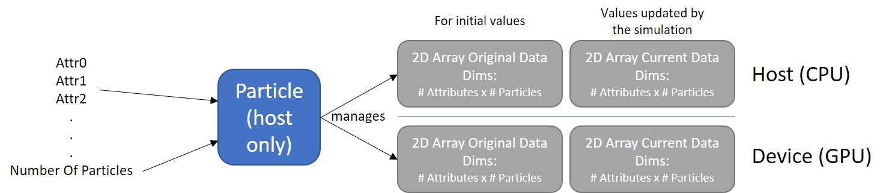

# Particles





### What is it?
---
Particles is a class designed to manage arrays of data associated with simulation particles.  Several 2D arrays are created on both device and host that track the initial state of particles, as well as their real-time data according to "attributes" specified on creation of an instance of the class.

In the 2D arrays, the first dimension refers to the attribute number, and the second dimension refers to the particle number.  "Attributes" refer to anything the user wishes to track about the particle as the simulation is executed.  This is commonly velocity and position, but could also refer to just about anything that is useful to the physics of the simulation.  Although it's recommended that "Attributes" don't refer to anything that is constant through the simulation, or constant amongst all particles, as this would be an inefficient use of space, it is technically possible to use them this way.

Particles also manages copying data back and forth to/from the GPU, as well as saving/loading data to/from disk, if desired.  If data saving/loading functions are called, `attributeNames` and `name` is used to generate the name of the files under which the data is saved, suffixed with ".bin".

Particles allocates and frees all memory associated with in on instantiation and destruction, respectively, unless `freeGPUMemory` is called before destruction.


### Use
---
After creating a [Simulation](./../Simulation/README.md), use the function `Simulation::createParticlesType` directly or use the [API function](./../API/README.md) `createParticlesAPI` to create a (or several) Particles instance(s).  A Particles can also be created through its constructor (below).


### Constructors
---
```
Particles(std::string name, std::vector<std::string> attributeNames, double mass, double charge, long numParts)
```
#### Input:
`name` - name of the Particles; this is used for saving/loading/printing on screen and needs to have all filesystem-safe characters

`mass` - mass of the particles in kg

`charge` - charge of the particles in C

`numParts` - number of particles to track


#### Output:
None


#### Side-Effects:
Creates a Particles instance with 2x 2D arrays # Attributes x # Particles in size on both host and device.  Generally size is not an issue for host, as system memory is often somewhere around an order of magnitude higher than GPU memory; however, for the aforementioned reason, arrays too big won't fit in the GPU memory, so plan accordingly.


### Public Member Functions
---
```
const std::vector<std::vector<double>>& data(bool orig) const
std::vector<double>& dataAttr(bool orig, int attrInd)
const std::vector<std::string>& attrNames() const
std::string name()    const
double      mass()    const
double      charge()  const
long        getNumberOfParticles()  const
int         getNumberOfAttributes() const
bool        getInitDataLoaded() const
double**    getOrigDataGPUPtr() const
double**    getCurrDataGPUPtr() const
int         getAttrIndByName(std::string searchName) const
std::string getAttrNameByInd(int searchInd) const
```
#### Input:
`orig` - a boolean representing whether to return the item associated with the original data or current data array - true specifies original, false specifies current

`*Ind` - index of the item returned by the function that uses it

`searchName` - name of attribute the user want to know the index of


#### Output:
`data(bool orig)` - returns a constant reference to either the original or current data array, specified by `orig`

`dataAttr(bool orig, int attrInd)` - returns a *non-const* reference to the attribute array, the index of which is specified by `attrInd`; returns either original or current data array depending on whether or not `orig` is true - true specifies original

`getAttrIndByName(std::string searchName)` - returns the index of the attribute named `searchName`

`getAttrNameByInd(int searchInd)` - returns the name of the attribute at `searchInd`

The remaining functions return self-explanatory items based on their name.


#### Side-Effects:
None for all above functions, although note that `dataAttr` returns a non-const reference, so calling functions may make changes to the array.


---
```
void loadDataFromMem(std::vector<std::vector<double>> data, bool orig = true)
```
#### Input:
`data` - 2D data array to assign to either original or current data array depending on the `orig` flag

`orig` - set original or current data to `data`; true denotes original, false denotes current


#### Output:
None


#### Side-Effects:
`data` is copied to either original or current data array.  Any existing data is lost.


---
```
void loadDataFromDisk(std::string folder, bool orig = true)
```
#### Input:
`folder` - folder in which ".bin" files are stored, named "`particleName`_`attributeName`.bin"; any attribute not accounted for will throw an error, which will be caught and written to `cerr`

`orig` - set original or current data to `data`; true denotes original, false denotes current


#### Output:
None


#### Side-Effects:
`data` is copied to either original or current data array.  Any existing data is lost.  If the file is not found, execution continues with the array left as {# particles} x `0`'s.


---
```
void saveDataToDisk(std::string folder, bool orig) const
```
#### Input:
`folder` - folder where saving will occur; if folder does not exist, exception will be thrown and caught, writing the details to `cerr`

`orig` - save original or current data to disk; true denotes original, false denotes current


#### Output:
None


#### Side-Effects:
Data is saved to disk, unless folder does not exist or other filesystem error occurs, in which case files are not written.  Note: it is possible to have an error for certain files and not others - i.e. some files write to disk, others do not.


---
```
void copyDataToGPU();
```
#### Input:
None


#### Output:
None


#### Side-Effects:
Copies *original data* from host to *current data* on device.  At the moment, [Simulation](./../Simulation/README.md) copies current data to original data on first run.


---
```
void copyDataToHost();
```
#### Input:
None


#### Output:
None


#### Side-Effects:
Copies current data from device to current data on host.


---
```
void freeGPUMemory();
```
#### Input:
None


#### Output:
None


#### Side-Effects:
Frees allocated memory on device.  After this is called, the memory locations are no longer accessible and trying to will generate an error.


---
```
void clearGPUMemory();
```
#### Input:
None


#### Output:
None


#### Side-Effects:
Sets allocated memory on device to 0s.  This allows the memory to be reused, as it hasn't been freed (as the above function accomplishes).