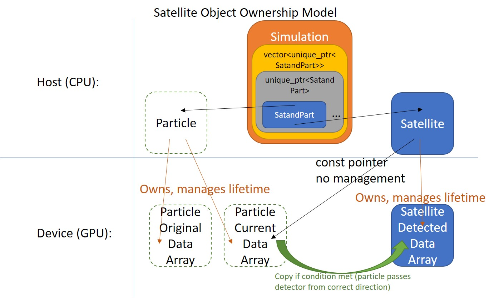

# Satellite





### What is it?
---
**`Satellite(double altitude, bool upwardFacing, int numberOfAttributes, long numberOfParticles, double** partDataGPUPtr, std::string name = "Satellite")`**

Satellite is a class responsible for checking whether or not a particle has passed a certain altitude.  It faces its detecter *either* up *or* down, *not* both and captures 2pi sr (upper hemisphere or lower hemisphere) of an imaginary sphere surrounding the satellite.  If both directions of detection is desired at an altitude, two satellites are required.  Modifying to account for real-world limited FOV of an actual detector may be necessary when comparing with real-world data.

Satellite allocates and frees all memory associated with in on instantiation and destruction, respectively, unless `freeGPUMemory` is called before destruction.

*Note: Altitude is in **_s_** - distance along a field line from the surface of the Earth, **_not_** **_r_** - the straight-line distance to the center of the Earth, or the traditional sense of **_altitude_** - the shortest straight-line distance to the surface of the Earth.*


### Use
---
After creating a [Simulation](./../Simulation/README.md), use the function `Simulation::createTempSat` directly or use the [API function](./../API/README.md) `createSatelliteAPI` to create a (or several) Satellite(s).  The [Simulation](./../Simulation/README.md) will manage the lifetime of the Satellite(s) and run the detection kernel at the appropriate time, as well as save data to disk automatically.  See [Simulation](./../Simulation/README.md) for the saved data structure.


### How created? (under the hood)
---
```
class Simulation {
protected:
	struct TempSat
	{//Struct that holds data to create satellite - allows satellites to be created before particles through API
		int particleInd;
		double altitude;
		bool upwardFacing;
		std::string name;
		/*
		   ...
		*/
	};

	struct SatandPart
	{//Satellite needs particle-specific data associated with it, so this struct holds a shared_ptr to the particle
		std::unique_ptr<Satellite> satellite;
		std::shared_ptr<Particles>  particle;
		/*
		   ...
		*/
	};
	/*
	   ...
	*/
};
```
`Simulation::createTempSat` and `createSatelliteAPI` create a `struct TempSat` which stores the data necessary to create the Satellite later on.  Once `Simulation::initializeSimulation` is called, `TempSats` are converted to `SatandParts`.  A struct to hold a pointer to both a Satellite and a [Particles](./../Particles/README.md) is necessary, because there are many times where modifying or understanding the data of a Satellite requires knowing various attributes about the associated [Particles](./../Particles/README.md) (ex: mass).  As you can guess, `TempSat.particleInd` must be a valid index to a [Particles](./../Particles/README.md) before calling `Simulation::initializeSimulation` or an exception will be thrown in that function.  It's ok if the [Particles](./../Particles/README.md) are created after the `TempSat` (and is the reason `TempSat` exists - to allow the user to create things in any order they want, as long as everything is created before `Simulation::initializeSimulation`).


### Constructors
---
```
Satellite(std::string name, std::vector<std::string> attributeNames, double altitude, bool upwardFacing, long numberOfParticles, double** partDataGPUPtr)
```
#### Input:
`name` - filesystem-safe name of the Satellite; will be used to save data to disk

`attributeNames` - vector of names of attributes used by the particle data

`altitude` - distance value from something meaningful to the simulation; units are determined by the use of the Satellite

`upwardFacing` - `true` means the detector is facing upward (hence, capturing downgoing particles); `false` specifies a downward facing detector

`numberOfParticles` - number of particles in the simulation (used to allocate room on GPU for capture array

`partDataGPUPtr` - pointer to data on GPU


#### Output:
None


#### Side-Effects:
Allocates on GPU memory for an array of doubles sized `(attributeNames.size() * numberOfParticles)` and zeroes it.  Also allocates room for higher dimension of the data array on GPU `(attributeNames.size() * sizeof(double*))` and sets up 2D array of pointers to the beginning of each attribute, saving the GPU pointers to the 1D and 2D arrays in variables.


### Public Member Functions
---
```
virtual void iterateDetector(double simtime, double dt, int blockSize)
```
#### Input:
`simtime` - current sim time, with units determined by the encapsulating class

`dt` - time step, with units determined by the encapsulating class

`blockSize` - CUDA blocksize for iterating over the particle array; set this to a value that makes sense


#### Output:
None


#### Side-Effects:
"Detects" whether or not a particle has passed this Satellite instance by calling the `satelliteDetector` kernel.  If so, saves the particle data to the GPU array that will be copied into a new `data_m` "measurement" by `copyDataToHost`.


---
```
virtual void copyDataToHost()
```
#### Input:
None


#### Output:
None


#### Side-Effects:
Copies data to host (CPU) from device (GPU).  2D data from GPU is `push_back`ed into `data_m`, representing something analogous to a recorded "measurement" (or a set of them).  Also clears the GPU memory, setting it to zero (but does *not* call cudaFree, so the memory remains allocated), as well as sets `dataReady` to `true` (this boolean is used to indicated whether or not this function needs to be called after iterating the detector).


---
```
virtual void freeGPUMemory()
```
Calls `cudaFree(memptr)` on the device memory allocated by the Satellite instance.  Called by `Simulation::freeGPUMemory`.  Beware that once freed, there is no interface for reallocating device memory.  Another new (or existing) instance will have to be used if `Simulation::iterateSimulation` is called again (and this instance will have to be destroyed, or `iterateDetector` will be called on it leading to an invalid (device) memory access, because it has been freed).


---
```
virtual void saveDataToDisk(std::string folder)
```
#### Input:
`folder` - folder where data will be saved; data saved in the format `folder/[name_m]_[attrName].bin`, where [attrName] refers to the attribute vector specified on creation


#### Output:
None


#### Side-Effects:
Calls `getConsolidatedData` with `removeZeros = true`, incurring those side-effects.


---
```
virtual void loadDataFromDisk(std::string folder, std::vector<std::string> attrNames)
```
#### Input:
`folder` - folder where data resides to load; data is in the format `folder/[name_m]_[attrName].bin`, where [attrName] refers to the attribute vector specified on creation


#### Output:
None


#### Side-Effects:
`data_m` is populated with data from disk and reconstructed (zeroes added, measurements[first index] split).


---
```
std::vector<std::vector<double>> getConsolidatedData(bool removeZeros)
```
#### Input:
`removeZeros` - specifies whether or not to remove zeroes from the data array that's returned


#### Output:
Returns a "flattened" (from 3D to 2D) array of Satellite data.  Array indicies represent `data[attribute ind][particle ind]`, where attributes is the list specified on creation of the class.


#### Side-Effects:
Calls `callDataToHost`, if necessary and if so, incurs all side effects from that function.  No other side effects, since a (modified) copy of the data is returned.


---
```
const std::vector<std::vector<std::vector<double>>>& data()
int         getNumberOfAttributes()
long        getNumberOfParticles()
double      altitude()
bool        upward()
std::string name()
```
#### Input:
None


#### Output:
Satellite attribute specified by the function name and with return type listed above


#### Side-Effects:
None for all functions


[Up a level](./../README.md)