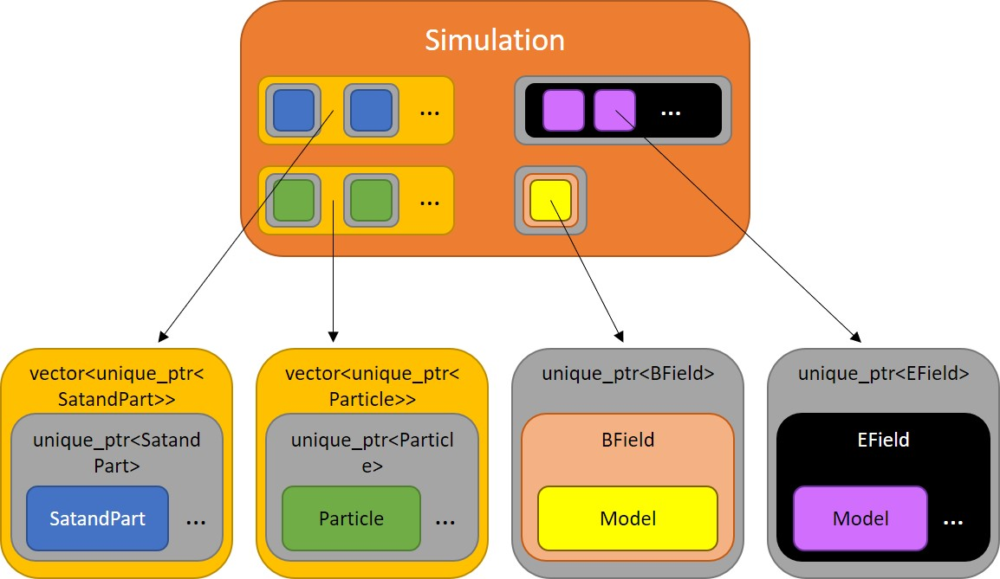

# Simulation





### What is it?
---
**`Simulation(double dt, double simMin, double simMax, std::string saveRootDir)`**

**`Simulation(std::string prevSimDir)`**

Simulation is a container class that integrates functionality from: [Particles](./../Particles/README.md), [Satellite](./../Satellite/README.md), [BModel](./../BModel/README.md) derived models, [EField](./../EField/README.md) derived models, and [Log](./../Log/README.md), managing the lifetime of instances through the use of smart pointers (with the exception of through the extern c API).  Simulation also contains the CUDA code that runs the core of the simulation (Fourth Order Runge Kutta, equation of motion, and a container function that manages early exiting (if the particle is not in simulation).  From outside C++, can be manipulated by numerous [API functions](./../API/README.md), including `createSimulationAPI` and `terminateSimulationAPI` as examples.

*Note: In this documentation, uppercase (and usually linked) names refer to classes, while lowercase names refer to non-class things.  For example: [Particles](./../Particles/README.md) refers to the class itself or an instance of the class which manages a large number of simulated physical particles (lowercase).  particle(s) usually refers to a collection of attributes (ex: v_para, v_perp or mu, and s, as well as maybe time, index, etc) that represents a `real-world physical particle`.*


### Use
---
Create a Simulation through the [API function](./../API/README.md) `createSimulationAPI` or with `std::make_unique<Simulation>(args)`.  Arguments are described in the below section.  Data is saved in the following way (and relies on this folder structure existing prior to saving):
```
.
├─ _chars : Simulation characteristics in '.bin' and '.txt' files for later loading
├─ bins : stores binary '.bin' files containing various data
│  ├─ particles_final : final particle data at the end of iterating
│  ├─ particles_init : initial particle data before iterating
│  └─ satellites : compressed (zeroes removed) captured satellite data for later processing
└─ ...
```


### Constructors
---
```
Simulation(double dt, double simMin, double simMax, std::string saveRootDir)
```
#### Input:
`dt` - the time step (in s) of the Simulation

`simMin` - distance along the specified B field line `s` below which a particle is run through `fuzzyIonosphere` (link to docs to be added) to determine whether or not it has scattered

`simMax` - distance along the specified B field line `s` above which a particle is no longer tracked, and potentially (not coded yet) at which another particle is created with downward velocity

`saveRootDir` refers to the directory where you want data saved.  Folder structure must mirror above.


#### Output:
None


#### Side-Effects:
New [SimAttributes](./../SimAttributes/README.md) Class is created, new [Log](./../Log/README.md) class is created with name: `Simulation.log`, `cerr` is redirected to a file within the folder structure above: `errors.log`


---
```
Simulation(std::string prevSimDir)
```
#### Input:
`prevSimDir` - folder of directory where the data from a previous Simulation is stored


#### Output:
None


#### Side-Effects:
Simulation is recreated exactly as it was run to produce the data in the folder indicated by `prevSimDir`.  This includes the [BModel](./../BModel/README.md) model specified for the previous Simulation, as well as all [EField](./../EField/README.md) models, [Particles](./../Particles/README.md) along with associated initial and final data, and [Satellites](./../Satellite/README.md) along with their measurement data.  This constructor overload relies on loading `Simulation.attr` in the root of that folder and will throw an exception if that file cannot be found.


### Public Member Functions
---
```
double	    simtime()
double	    dt()
double      simMin()
double      simMax()
size_t      getNumberOfParticleTypes()
size_t      getNumberOfSatellites()
size_t      getNumberOfParticles(int partInd)
size_t      getNumberOfAttributes(int partInd)
std::string getParticlesName(int partInd)
std::string getSatelliteName(int satInd)
Log*    log()
Particles*   particle(int partInd)
Particles*   particle(std::string name)
Satellite*  satellite(int satInd)
Satellite*  satellite(std::string name)
BModel*     Bmodel()
EField*     Emodel()
const std::vector<std::vector<double>>& getParticleData(int partInd, bool originalData);
const std::vector<std::vector<std::vector<double>>>& getSatelliteData(int satInd);
```
#### Inputs:
`{*}Ind` - index of class desired

`name` - name of class desired

`originalData` - specifies whether to return original/initial data or current (data that is post-iteration); for more information on data structure, see the documentation for the class in question


#### Outputs:
Self-explanatory outputs - either returns the value in question, a pointer to a class instance, a 2D/3D data vector, or throws an exception if the index or name is invalid.


#### Side-Effects:
None for all functions


---
```
void Simulation::createParticlesType(std::string name, double mass, double charge, long numParts, std::string loadFilesDir="", bool save=true)
```
#### Input:
`name` - name of the particle; this can be any valid string that can comprise a filename - it will be used to save files to disk

`mass` - mass of the particle, in kg (for the purpose of this Simulation)

`charge` - charge of the particle, in C (for the purpose of this Simulation)

`numParts` - number of particles that this instance of [Particles](./../Particles/README.md) will track

`loadFilesDir` - if you wish to load a distribution, specify the folder where the `.bin` files are located here; files must be saved in double binary format and saved with the name `[name]_[attr].bin` where `[attr]` refers to `{ vpara, vperp, s, t_inc, t_esc }` for the purposes of this Simulation; defaults to "", which will load nothing into the [Particles](./../Particles/README.md) instance; non-fatal exception is thrown (and caught/output to `errors.log`) if files don't exist according to name specified and attributes listed above, and array is left as zeroes for the attribute that wasn't found

`save` - specifies whether or not this [Particles's](./../Particles/README.md) instance is added to the savefile that specifies the Simulation; defaults to `true` and should be left the default value, or when loading the Simulation later, this instance will not be recreated in the loaded Simulation


#### Output:
None


#### Side-Effects:
Creates a [Particles](./../Particles/README.md) instance with specified attributes and stores in the Simulation instance for management.


---
```
void Simulation::createTempSat(int partInd, double altitude, bool upwardFacing, std::string name)
void Simulation::createTempSat(std::string partName, double altitude, bool upwardFacing, std::string name)
```
#### Input:
`partInd` - index of the [Particles](./../Particles/README.md) that this [Satellite](./../Satellite/README.md) instance is tracking (they only track one at a time, as detailed in the docs for that class)

`partName` - name of the associated [Particles](./../Particles/README.md)

`altitude` - location `s` (in m for this Simulation) along the specified B field line from the surface of the Earth; **note: this is not `r`, the distance from the center of the Earth, nor the traditional sense of altitude - the distance from the surface of the Earth at its nearest point (or sea level)**

`upwardFacing` - whether the detector is facing up (in altitude) or down (in altitude); if both are desired, two [Satellites](./../Satellite/README.md) are required - see docs for more details

`name` - name to assign to the [Satellite](./../Satellite/README.md); can be anything that's filesystem-safe - it will be used in filenames


#### Output:
None


#### Side-Effects:
Creates a [Satellite](./../Satellite/README.md) instance with specified attributes and stores in the Simulation instance for management.


---
```
void Simulation::setBFieldModel(std::string name, std::vector<double> args, bool save)
void setBFieldModel(std::unique_ptr<BModel> BModelptr)
```
**Note: only one B model can be specified per Simulation as of now and an exception will be thrown if one exists when calling this function**
#### Input:
`name` - name of [BModel](./../BModel/README.md) model; see docs for more info on the available models

`args` - vector of arguments to create specified model; must have the appropriate number of arguments to instantiate a class of specified B model type; see docs above for more info on the model required arguments

`save` - specifies whether the data from the B model is added to the savefile; defaults to true and is best to leave this alone

`BModelptr` - std::unique_ptr to a BModel instance specified by the user; make sure to properly move with std::move


#### Output:
None


#### Side-Effects:
Creates a [BModel](./../BModel/README.md) model, depending on the user's specification and stores it in the Simulation instance for management.


---
```
void Simulation::addEFieldModel(std::string name, std::vector<std::vector<double>> args, bool save)
void addEFieldModel(std::unique_ptr<EModel> EModelptr)
```
#### Input:
`name` - name of [EField](./../EField/README.md) model; see docs for more info on the available models

`args` - vector of arguments to create specified model; must have the appropriate number of arguments to instantiate a class of specified B model type

`save` - specifies whether the data from the B model is added to the savefile; defaults to true and is best to leave this alone

`EModelptr` - std::unique_ptr to a [EModel](./../EField/README.md) instance specified by the user; make sure to properly move with std::move


#### Output:
None


#### Side-Effects:
Creates a [EField](./../EField/README.md) model, depending on the user's specification and adds it in the Simulation instance for management, along with others, if they exist.


---
```
double getBFieldAtS(double s, double time)
double getEFieldAtS(double s, double time)
```
#### Input:
`s` - distance along B field line from the surface of the Earth

`time` - simulation time in s; if field is time independent, this can be zero


#### Output:
Returns the field strength due to the specified B/E model(s).


#### Side-Effects:
None


---
```
void Simulation::initializeSimulation()
```
#### Input:
None


#### Output:
None


#### Side-Effects:
Sets up simulation and prepares for iteration.  Converts TempSats to [Satellites](./../Satellite/README.md) (technically SatandParts).  If no [EField](./../EField/README.md) model was added to the Simulation, creates a blank one and stores GPU pointer to `EFieldModel_d` variable.


---
```
void Simulation::iterateSimulation(int numberOfIterations, int checkDoneEvery)
```
#### Input:
`numberOfIterations` - specifies number of times to iterate each particle over the Simulation's `dt`

`checkDoneEvery` - specifies how often to check whether or not every particle has escaped the Simulation; a high value is recommended, depending on how long the sim takes to run (author usually uses 500)


#### Output:
None


#### Side-Effects:
Iterate all particles in Simulation through [B](./../BModel/README.md)/[E](./../EField/README.md) Field models for specified number of iterations, modifying position and velocity until the particle escapes or until `numberOfIterations` has elapsed. Runs [Satellite](./../Satellite/README.md) detection kernel for each specified [Satellite](./../Satellite/README.md) at each time step.  Also manages copying data to GPU at the start, converting vperp<>mu on both ends (vperp->mu before, mu->vperp after), and copying back to host (from GPU) once complete.  `simTime_m` is also reset to zero.


---
```
virtual void saveDataToDisk()
```
#### Input:
None


#### Output:
None


#### Side-Effects:
Calls saveDataToDisk of [Particles](./../Particles/README.md) and [Satellites](./../Satellite/README.md) managed by Simulation.  This implies that all the side-effects of those functions are incurred.  In addition, [SimAttributes](./../SimAttributes/README.md) is destroyed (hence, saving the associated attributes file to disk), and means that no further classes can be saved to disk in this Simulation instance.  This function is called automatically by `iterateSimulation` once iterations are complete.


---
```
void Simulation::freeGPUMemory()
```
#### Input:
None


#### Output:
None


#### Side-Effects:
Frees GPU memory for all classes.  Call if freeing GPU memory is desired prior to destructors being called (classes all free their own GPU memory on destruction).  Keep in mind that once this happens, you won't be able to use on GPU memory for [Particles](./../Particles/README.md) and [Satellites](./../Satellite/README.md) unless you destroy them and create new ones (memory is automatically allocated upon initialization).  At this time, there is no function to reallocate GPU memory for these classes once freed (hence having to destroy/recreate).


---
```
void Simulation::resetSimulation(bool fields)
```
#### Input:
`fields` - specifies whether fields models are destroyed or not


#### Output:
None


#### Side-Effects:
Destroys all [Satellites](./../Satellite/README.md) and [Particles](./../Particles/README.md), as well as [BModel](./../BModel/README.md) model, and [EField](./../EField/README.md) model(s) if `fields` is `true`.  Used to reset the simulation without having to destroy the entire instance of this class and associated data.  This is useful when, for example, generating a backscatter distribution and rerunning to add to the prior data.


### CUDA Kernels
---
```
__global__ void computeKernel(double** currData_d, BModel** BModel, EField** efield,
	const double simtime, const double dt, const double mass, const double charge, const double simmin, const double simmax)
```
#### Inputs:
`currData_d` - pointer to 2D particle data array that will be iterated; indicies refer to `currData_d[attribute][particle ind]` where `attribute` is ordered `{ vpara, mu, s, t_incident, t_escaped }`

`BModel` - pointer to (pointer to) on-GPU [BModel](./../BModel/README.md) instance

`efield` - pointer to (pointer to) on-GPU [EField](./../EField/README.md) instance

`simtime` - current sim time in s

`dt` - time step in s

`mass` - mass in kg

`charge` - charge in C

`simmin` - minimum `s` of the Simulation

`simmax` - maximum `s` of the Simulation


#### Outputs:
None


#### Side-Effects:
On GPU particle data array is changed according to the equation of motion (Fourth Order Runge Kutta mirror and Lorentz forces) - particle is skipped if it is outside simulation.  No changes occur to instances referred to by `BModel` and `efield`.


---
```
__global__ void vperpMuConvert(double** dataToConvert, BModel** BModel, double mass, bool vperpToMu)
```
#### Inputs:
`dataToConvert` - on-GPU 2D array pointer with dimensions ordered the same as `computeKernel`

`BModel` - pointer to on-GPU [BModel](./../BModel/README.md) instance

`mass` - particle mass in kg

`vperpToMu` - specifies direction of conversion; `true` converts data from vperp to mu; `false` converts data from mu to vperp


#### Outputs:
None


#### Side-Effects:
Index [1] of the first argument is converted to either vperp or mu depending on what is specified.


Device kernels (foRungeKuttaCUDA and accel1dCUDA) are not documented here - you can't call these anyway, and are pretty easy to work out with the comments in-code.


### Protected Member Structs and Data
---
```
protected:
struct TempSat
{
     int particleInd;
	 double altitude;
	 bool upwardFacing;
	 std::string name;
	 /*
	   ...
	 */
}
```
Stores data necessary to create a [Satellite](./../Satellite/README.md).  This is necessary because creating a [Satellite](./../Satellite/README.md) requires the associated particle to already be created.  This temporary data holder allows satellites to be specified first.  **This is created through the** `Simulation::createTempSat` **member function and** `createSatelliteAPI` **API function and will never need to be accessed directly.**


---
```
protected:
struct SatandPart
{
	std::unique_ptr<Satellite> satellite;
	std::shared_ptr<Particles>  particle;
	/*
	   ...
	*/
}	
```
Stores smart pointers to [Satellite](./../Satellite/README.md) instance and associated [Particles](./../Particles/README.md).  This oddity is unfortunately necessary due to the fact that [Particles](./../Particles/README.md) data is inseparably tied to [Satellite](./../Satellite/README.md).  **This will never have to be created manually.  Lifetime (including creation) is managed by Simulation.**


**_Other protected data and functions not documented here._**


[Up a level](./../README.md)